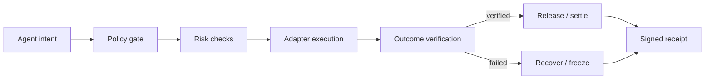

# Agent Control Plane

### AgentGuard VerifyPay — policy-controlled commerce for autonomous AI agents.

**Built for hackathons: make an Agent useful without making it unconstrained.**

One Agent can hire another Agent or API. AgentGuard decides whether the quote and
execution are still allowed — within explicit permissions, budgets, risk limits,
deadlines, and verification rules.

<p>
  <a href="https://github.com/0xCaptain888/agent-control-plane/actions/workflows/ci.yml"></a>
  <a href="https://github.com/0xCaptain888/agent-control-plane"></a>
  <a href="https://github.com/0xCaptain888/agent-control-plane"></a>
  <a href="https://github.com/0xCaptain888/agent-control-plane/blob/main/SECURITY.md"></a>
</p>

<p>
  <a href="https://0xcaptain888.github.io/agent-control-plane/">Live Marketplace</a> ·
  <a href="docs/demo-script.md">3-minute demo</a> ·
  <a href="docs/submission-kit.md">Submission kit</a> ·
  <a href="docs/arbitrum-hackathon.md">Arbitrum evidence</a> ·
  <a href="docs/bnb-hackathon.md">BNB evidence</a>
</p>


> **Core invariant:** an agent may act, but never beyond policy — and no payment or execution is accepted until the outcome is verified.

## Why this exists

Agent demos usually stop at “the model called a tool.” Production systems need the missing control layer around that call:

- Is this action permitted for this agent?
- Is it still inside budget, target, time, and risk limits?
- Did the execution produce the promised outcome?
- If transport or verification fails, can funds and state be frozen safely?
- Can a judge, operator, or auditor verify what happened later?

## The execution lifecycle



## Capability surface

| Layer | Guarantees | Examples |
| --- | --- | --- |
| **Policy** | permissions, budgets, targets, approvals, time windows | “Only trade SOL on Devnet under 0.01 SOL” |
| **Risk** | simulation, exposure, duplication, slippage, runtime drift | block a changed quote or repeated action |
| **Execution** | exchange, chain, payment, MCP, x402, workflow adapters | OKX, Solana RPC, EVM, escrow, MCP |
| **Verification** | accept only an outcome that satisfies the task | validate an API result before release |
| **Recovery** | cancel, refund, retry, freeze, circuit breaker | freeze on transport or verification failure |
| **Receipts** | auditable decisions, proofs, and execution history | SHA-256 Merkle proofs and lifecycle receipts |

## Judge-first demos

Each reference app demonstrates a distinct winning moment and reuses the same control-plane lifecycle:

| Demo | What a judge sees |
| --- | --- |
| [Safe Trade](examples/safe-trade) | approved action, blocked action, and frozen outcome |
| [Agent Commerce](examples/agent-commerce) | quote → escrow → verify → release or recover |
| [API Procurement](examples/api-procurement) | payment released only after result verification |
| [OKX Trade](examples/okx-trade) | exchange adapter with explicit policy and freeze paths |
| [Treasury Guard](examples/treasury-guard) | allocation limits, risk thresholds, and circuit breakers |
| [Solana Devnet](examples/solana-devnet) | resilient RPC, external signing, confirmation, and audit failure handling |

## The judge path

```text
1. Hire SafeSwap Agent with a 50 USDT budget.
2. Show VERIFIED: result passes, payment releases, receipt is created.
3. Raise the budget above policy: BLOCKED before the adapter is called.
4. Return an out-of-policy fill: FROZEN with evidence and recovery state.
5. Open the live ERC-8004 / ERC-8183 evidence in the Marketplace.
```

The important distinction is not “an Agent called a tool.” It is that the same
control plane proves what the Agent was allowed to do, what actually happened,
and why funds were released or frozen.

### The canonical product story

AgentGuard's primary use case is a **Treasury Agent hiring a Risk or Data Agent**
before moving treasury funds. The buyer Agent proposes a bounded task, the
seller returns a quote and evidence, and Arbitrum holds the USDC budget until
the evidence matches the policy. This is the product path; the BNB Agent
profiles are compatibility examples built on the same control-plane contract.

For the judge-facing path, the public Marketplace leads with the Arbitrum
VerifyPay flow — Research Agent hires Data Agent — and also exposes four BNB
Agent categories — SafeSwap, RebalanceGuard, YieldScout, and HealthGuard — with
independent policy boundaries and activation presets.

## Run it in five minutes

Use Node.js **22** (the repository pins `22.23.2` in [.nvmrc](.nvmrc)).

```bash
npm ci
npm run lint
npm run typecheck
npm test
```

Run the read-only Solana Devnet probe:

```bash
set -a; source .env; set +a
npm run demo:solana
```

Run the offline judge flow first:

```bash
npm run demo:judge
```

It shows `VERIFIED`, `BLOCKED`, and `FROZEN` outcomes with auditable receipts in one command. See the [Judge Demo](docs/demo.md).

Run the Arbitrum Sepolia PolicyEscrow proof:

```bash
npm run demo:arbitrum:task
npm run demo:arbitrum:judge
npm run demo:verify-pay
npm run demo:arbitrum:evidence
npm run demo:treasury-agent
```

`demo:arbitrum:evidence` is a read-only RPC check. It independently verifies
the deployed bytecode exists, Task `1` is `VERIFIED`, the policy and evidence
hashes match the repository proof, and the settlement receipt succeeded.

`demo:treasury-agent` shows the canonical buyer flow: a Treasury Agent turns an
objective into a bounded hire request, compares registered seller capabilities,
checks the quote against budget, and fails closed before escrow when the request
cannot be satisfied.

When the local Marketplace server is running, the same public, read-only plan is
available at `/api/treasury/plan` for judge tooling and integrations.

PolicyEscrowV2 also exposes a testnet ERC-20 path. Set
`ARBITRUM_TEST_TOKEN_ADDRESS` locally before running
`npm run demo:arbitrum:token-task`; the command fails closed when no token is
configured.

The deployment and task evidence are recorded in
[`deployments/arbitrum-sepolia-policy-escrow.json`](deployments/arbitrum-sepolia-policy-escrow.json).
To deploy a fresh testnet instance, run `npm run demo:arbitrum:deploy` with a
local Keychain wallet or an ignored `ARBITRUM_PRIVATE_KEY` environment variable.

Run the BNB AgentGuard Marketplace vertical slice:

```bash
npm run demo:bnb
```

Open the judge-facing Marketplace UI:

```bash
cd apps/marketplace
npm start
```

See the [Arbitrum hackathon build guide](docs/arbitrum-hackathon.md) for the
Agentic AI submission path. The [BNB hackathon build guide](docs/bnb-hackathon.md)
documents the existing cross-chain evidence.

The optional signing probe sends only a tiny self-transfer on Devnet:

```bash
npm run demo:solana:transfer
```

## Repository map

```text
packages/   domain-neutral control-plane contracts and receipt logic
adapters/   exchange, chain, payment, MCP, x402, and workflow integrations
examples/   hackathon-ready reference applications
apps/       human-facing policy and receipt dashboards
docs/       architecture, safety rules, migration notes, and judging guide
```

## What is real vs. simulated

| Surface | Status |
| --- | --- |
| ERC-8004 identities | Real BNB Testnet registrations, Agent IDs `1898`, `1902`, `1903`, and `1904` |
| ERC-8183 task | Real BNB Testnet Job `614`, funded, submitted, settled, and `COMPLETED` |
| Arbitrum settlement | Real Arbitrum Sepolia `PolicyEscrowV2` deployment, verified source, and `VERIFIED` task |
| Arbitrum evidence check | Read-only RPC verification of contract, task state, hashes, and settlement receipt |
| Marketplace | Public GitHub Pages deployment |
| Judge lifecycle | Deterministic, offline-safe reference scenarios |
| Mainnet execution | Disabled by design |
| Production database / auth | Roadmap, not claimed as deployed |

## Latest BNB Testnet proof

SafeSwap completed a real ERC-8183 task on BNB Testnet. The settlement receipt
was independently verified by the BNB receipt adapter.

- Job: `614`
- Status: `COMPLETED`
- Budget: `1 U`
- Settlement: [View on BscScan](https://testnet.bscscan.com/tx/0x5dc5469cfdb84c9758208b0bee796f775203dca6445bf9fc98a7f3becb82aa93)
- Settlement transaction hash: `0x5dc5469cfdb84c9758208b0bee796f775203dca6445bf9fc98a7f3becb82aa93`
- Receipt evidence hash: `5c9bd98ffd7de6fa5a1d2ff26cec2f0fb2e951ef8b608d9444ffb811bf512f5b`
- Public Marketplace: [Open the live demo](https://0xcaptain888.github.io/agent-control-plane/)

## Latest Arbitrum Sepolia proof

The AgentGuard PolicyEscrowV2 contract is deployed on Arbitrum Sepolia and has
completed a real funded VerifyPay task with a deadline, policy decision hash,
evidence-backed verification, and native ETH settlement.

- Network: Arbitrum Sepolia (`421614`)
- Contract: [`0xe2e444a7b742829f9d45b1165b352dbbf9f9d999`](https://sepolia.arbiscan.io/address/0xe2e444a7b742829f9d45b1165b352dbbf9f9d999#code) — **Source Code Verified · Exact Match**
- Deployment transaction: [`0x7a0cd5fe0ef72a6798e345e828a8e09d7d93ec1e7b640816904a962ce268d3ba`](https://sepolia.arbiscan.io/tx/0x7a0cd5fe0ef72a6798e345e828a8e09d7d93ec1e7b640816904a962ce268d3ba)
- Task: `1`
- Policy hash: `0x1111111111111111111111111111111111111111111111111111111111111111`
- Evidence hash: `0x2222222222222222222222222222222222222222222222222222222222222222`
- Verified settlement: [`0xc11864b4fa56a8906a036d9bff1f1ac4af9dc1e67324bbdbf53fdec996b5b5ce`](https://sepolia.arbiscan.io/tx/0xc11864b4fa56a8906a036d9bff1f1ac4af9dc1e67324bbdbf53fdec996b5b5ce)
- Decision reason hash: `0x3333333333333333333333333333333333333333333333333333333333333333`
- Real frozen proof: [`0xa521a24b092fd8d7c3210e050b868d5e50ec414be217a318699adc7a60a88fa9`](https://sepolia.arbiscan.io/tx/0xa521a24b092fd8d7c3210e050b868d5e50ec414be217a318699adc7a60a88fa9)

### Real ERC-20 / USDC proof

Task `3` completed a real `0.1 USDC` VerifyPay lifecycle on Arbitrum Sepolia:

- Token: [`0x75faf114eafb1BDbe2F0316DF893fd58CE46AA4d`](https://sepolia.arbiscan.io/address/0x75faf114eafb1BDbe2F0316DF893fd58CE46AA4d)
- Evidence hash: `0x5555555555555555555555555555555555555555555555555555555555555555`
- Approve: [`0xaf4e68ed72b107fb8b4c452741ff0527bc9ffd0f4349fe2534549b0c6c8c992a`](https://sepolia.arbiscan.io/tx/0xaf4e68ed72b107fb8b4c452741ff0527bc9ffd0f4349fe2534549b0c6c8c992a)
- Create: [`0x5c3a3c637bc464b70fb1c0f04ef5a8292810a8617f50522d81690ae2ab20da2c`](https://sepolia.arbiscan.io/tx/0x5c3a3c637bc464b70fb1c0f04ef5a8292810a8617f50522d81690ae2ab20da2c)
- Submit: [`0x995a17ba32c83499385e85c3fe3cd909407c7c124aeee99596a03c6429b711f3`](https://sepolia.arbiscan.io/tx/0x995a17ba32c83499385e85c3fe3cd909407c7c124aeee99596a03c6429b711f3)
- Verify / release: [`0x78ac0e4246058686dddb0590032e9c94b62571991c75f53f4b12c0c8e87c858b`](https://sepolia.arbiscan.io/tx/0x78ac0e4246058686dddb0590032e9c94b62571991c75f53f4b12c0c8e87c858b)

### Verified Contract

- Status: **Source Code Verified · Exact Match** on Arbitrum Sepolia (verified August 25, 2026)
- [PolicyEscrowV2 source, ABI, and Read/Write Contract UI on Arbiscan](https://sepolia.arbiscan.io/address/0xe2e444a7b742829f9d45b1165b352dbbf9f9d999#code)
- Compiler: Solidity `v0.8.26+commit.8a97fa7a`
- Optimizer: enabled, `200` runs
- License: MIT; constructor arguments: none
- Reproducible input: [`artifacts/arbiscan/PolicyEscrowV2-standard-input.json`](artifacts/arbiscan/PolicyEscrowV2-standard-input.json)

## Safety boundary

- Demo defaults are simulated or testnet-only.
- Signing stays outside the dependency-free control-plane adapter.
- Runtime credentials belong in the local OKX profile or ignored `.env`, never in Git.
- Failed transport and verification paths produce frozen, auditable outcomes.
- See [SECURITY.md](SECURITY.md) and [local development safety](docs/local-development.md).

## Verification

The current reference implementation is validated with:

```text
53 tests passing (9 Node + 44 TypeScript) · lint passing · typecheck passing · security preflight passing
```

More detail:

- [Architecture](docs/architecture.md)
- [Judge scorecard](docs/judge-scorecard.md)
- [Judge Demo](docs/demo.md)
- [Hackathon judge guide](docs/hackathon-guide.md)
- [Arbitrum security notes](docs/arbitrum-security-notes.md)
- [Verified Contract and source-verification package](docs/arbitrum-contract-verification.md)
- [Adapter contract](adapters/README.md)
- [Contribution guide](CONTRIBUTING.md)
