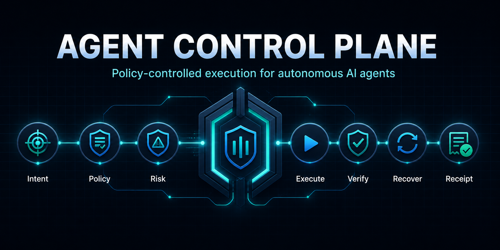
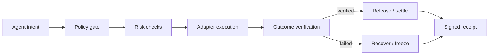

# Agent Control Plane

### The policy-controlled execution layer for autonomous AI agents.

**Built for hackathons: make an Agent useful without making it unconstrained.**

Agents can propose actions. The control plane decides whether they are still allowed to act — within explicit permissions, budgets, risk limits, and verification rules.

<p>
  <a href="https://github.com/0xCaptain888/agent-control-plane/actions/workflows/ci.yml"></a>
  <a href="https://github.com/0xCaptain888/agent-control-plane"></a>
  <a href="https://github.com/0xCaptain888/agent-control-plane"></a>
  <a href="https://github.com/0xCaptain888/agent-control-plane/blob/main/SECURITY.md"></a>
</p>

<p>
  <a href="https://0xcaptain888.github.io/agent-control-plane/">Live Marketplace</a> ·
  <a href="docs/demo-script.md">3-minute demo</a> ·
  <a href="docs/submission-kit.md">Submission kit</a> ·
  <a href="docs/bnb-hackathon.md">BNB evidence</a>
</p>



> **Core invariant:** an agent may act, but never beyond policy — and no payment or execution is accepted until the outcome is verified.

## Why this exists

Agent demos usually stop at “the model called a tool.” Production systems need the missing control layer around that call:

- Is this action permitted for this agent?
- Is it still inside budget, target, time, and risk limits?
- Did the execution produce the promised outcome?
- If transport or verification fails, can funds and state be frozen safely?
- Can a judge, operator, or auditor verify what happened later?

## The execution lifecycle



## Capability surface

| Layer | Guarantees | Examples |
| --- | --- | --- |
| **Policy** | permissions, budgets, targets, approvals, time windows | “Only trade SOL on Devnet under 0.01 SOL” |
| **Risk** | simulation, exposure, duplication, slippage, runtime drift | block a changed quote or repeated action |
| **Execution** | exchange, chain, payment, MCP, x402, workflow adapters | OKX, Solana RPC, EVM, escrow, MCP |
| **Verification** | accept only an outcome that satisfies the task | validate an API result before release |
| **Recovery** | cancel, refund, retry, freeze, circuit breaker | freeze on transport or verification failure |
| **Receipts** | auditable decisions, proofs, and execution history | SHA-256 Merkle proofs and lifecycle receipts |

## Judge-first demos

Each reference app demonstrates a distinct winning moment and reuses the same control-plane lifecycle:

| Demo | What a judge sees |
| --- | --- |
| [Safe Trade](examples/safe-trade) | approved action, blocked action, and frozen outcome |
| [Agent Commerce](examples/agent-commerce) | quote → escrow → verify → release or recover |
| [API Procurement](examples/api-procurement) | payment released only after result verification |
| [OKX Trade](examples/okx-trade) | exchange adapter with explicit policy and freeze paths |
| [Treasury Guard](examples/treasury-guard) | allocation limits, risk thresholds, and circuit breakers |
| [Solana Devnet](examples/solana-devnet) | resilient RPC, external signing, confirmation, and audit failure handling |

## The judge path

```text
1. Hire SafeSwap Agent with a 50 USDT budget.
2. Show VERIFIED: result passes, payment releases, receipt is created.
3. Raise the budget above policy: BLOCKED before the adapter is called.
4. Return an out-of-policy fill: FROZEN with evidence and recovery state.
5. Open the live ERC-8004 / ERC-8183 evidence in the Marketplace.
```

The important distinction is not “an Agent called a tool.” It is that the same
control plane proves what the Agent was allowed to do, what actually happened,
and why funds were released or frozen.

## Run it in five minutes

Use Node.js **22** (the repository pins `22.23.2` in [.nvmrc](.nvmrc)).

```bash
npm ci
npm run lint
npm run typecheck
npm test
```

Run the read-only Solana Devnet probe:

```bash
set -a; source .env; set +a
npm run demo:solana
```

Run the offline judge flow first:

```bash
npm run demo:judge
```

It shows `VERIFIED`, `BLOCKED`, and `FROZEN` outcomes with auditable receipts in one command. See the [Judge Demo](docs/demo.md).

Run the BNB AgentGuard Marketplace vertical slice:

```bash
npm run demo:bnb
```

Open the judge-facing Marketplace UI:

```bash
cd apps/marketplace
npm start
```

See the [BNB hackathon build guide](docs/bnb-hackathon.md) for the marketplace flow, testnet boundary, and submission checklist.

The optional signing probe sends only a tiny self-transfer on Devnet:

```bash
npm run demo:solana:transfer
```

## Repository map

```text
packages/   domain-neutral control-plane contracts and receipt logic
adapters/   exchange, chain, payment, MCP, x402, and workflow integrations
examples/   hackathon-ready reference applications
apps/       human-facing policy and receipt dashboards
docs/       architecture, safety rules, migration notes, and judging guide
```

## What is real vs. simulated

| Surface | Status |
| --- | --- |
| ERC-8004 identity | Real BNB Testnet registration, Agent ID `1898` |
| ERC-8183 task | Real BNB Testnet Job `603`, funded, submitted, and completed |
| Marketplace | Public GitHub Pages deployment |
| Judge lifecycle | Deterministic, offline-safe reference scenarios |
| Mainnet execution | Disabled by design |
| Production database / auth | Roadmap, not claimed as deployed |

## Safety boundary

- Demo defaults are simulated or testnet-only.
- Signing stays outside the dependency-free control-plane adapter.
- Runtime credentials belong in the local OKX profile or ignored `.env`, never in Git.
- Failed transport and verification paths produce frozen, auditable outcomes.
- See [SECURITY.md](SECURITY.md) and [local development safety](docs/local-development.md).

## Verification

The current reference implementation is validated with:

```text
41 tests passing · lint passing · typecheck passing · security preflight passing
```

More detail:

- [Architecture](docs/architecture.md)
- [Judge Demo](docs/demo.md)
- [Hackathon judge guide](docs/hackathon-guide.md)
- [Adapter contract](adapters/README.md)
- [Contribution guide](CONTRIBUTING.md)
