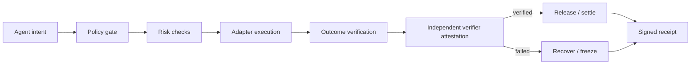

<p align="center">
  
</p>

# Agent Control Plane

### AgentGuard VerifyPay — policy-controlled commerce for autonomous AI agents.

**Built for hackathons: make an Agent useful without making it unconstrained.**

One Agent can hire another Agent or API. AgentGuard decides whether the quote and
execution are still allowed — within explicit permissions, budgets, risk limits,
deadlines, and verification rules.

<p>
  <a href="https://github.com/0xCaptain888/agent-control-plane/actions/workflows/ci.yml"></a>
  <a href="https://github.com/0xCaptain888/agent-control-plane"></a>
  <a href="https://github.com/0xCaptain888/agent-control-plane"></a>
  <a href="https://github.com/0xCaptain888/agent-control-plane/blob/main/SECURITY.md"></a>
</p>

<p>
  <a href="https://0xcaptain888.github.io/agent-control-plane/">Choose submission edition</a> ·
  <a href="https://0xcaptain888.github.io/agent-control-plane/?network=bnb">BNB demo</a> ·
  <a href="https://0xcaptain888.github.io/agent-control-plane/?network=arbitrum">Arbitrum demo</a> ·
  <a href="docs/demo-script.md">3-minute demo</a> ·
  <a href="docs/submission-kit.md">Submission kit</a> ·
  <a href="docs/chain-fit.md">Why BNB + Arbitrum</a> ·
  <a href="docs/arbitrum-hackathon.md">Arbitrum evidence</a> ·
  <a href="docs/bnb-hackathon.md">BNB evidence</a>
</p>


> **Core invariant:** an agent may act, but never beyond policy — and no payment or execution is accepted until the outcome is verified.

## Why this exists

Agent demos usually stop at “the model called a tool.” Production systems need the missing control layer around that call:

- Is this action permitted for this agent?
- Is it still inside budget, target, time, and risk limits?
- Did the execution produce the promised outcome?
- If transport or verification fails, can funds and state be frozen safely?
- Can a judge, operator, or auditor verify what happened later?

## The execution lifecycle



## Capability surface

| Layer | Guarantees | Examples |
| --- | --- | --- |
| **Policy** | permissions, budgets, targets, approvals, time windows | “Only trade SOL on Devnet under 0.01 SOL” |
| **Risk** | simulation, exposure, duplication, slippage, runtime drift | block a changed quote or repeated action |
| **Execution** | exchange, chain, payment, MCP, x402, workflow adapters | OKX, Solana RPC, EVM, escrow, MCP |
| **Verification** | accept only an outcome that satisfies the task | validate an API result before release |
| **Attestation** | independent signature bound to task, policy, evidence, chain and expiry | EIP-712 Verifier Agent proof |
| **Recovery** | cancel, refund, retry, freeze, circuit breaker | freeze on transport or verification failure |
| **Receipts** | auditable decisions, proofs, and execution history | SHA-256 Merkle proofs and lifecycle receipts |

## Judge-first demos

Each reference app demonstrates a distinct winning moment and reuses the same control-plane lifecycle:

| Demo | What a judge sees |
| --- | --- |
| [Safe Trade](examples/safe-trade) | approved action, blocked action, and frozen outcome |
| [Agent Commerce](examples/agent-commerce) | quote → escrow → verify → release or recover |
| [API Procurement](examples/api-procurement) | payment released only after result verification |
| [OKX Trade](examples/okx-trade) | exchange adapter with explicit policy and freeze paths |
| [Treasury Guard](examples/treasury-guard) | allocation limits, risk thresholds, and circuit breakers |
| [Solana Devnet](examples/solana-devnet) | resilient RPC, external signing, confirmation, and audit failure handling |

## The judge path

```text
1. Hire SafeSwap Agent with a 50 USDT budget.
2. Show VERIFIED: result passes, payment releases, receipt is created.
3. Raise the budget above policy: BLOCKED before the adapter is called.
4. Return an out-of-policy fill: FROZEN with evidence and recovery state.
5. Open the live ERC-8004 / ERC-8183 evidence in the Marketplace.
```

The important distinction is not “an Agent called a tool.” It is that the same
control plane proves what the Agent was allowed to do, what actually happened,
and why funds were released or frozen.

## Canonical Agent-to-Agent path

The winning path is one Buyer Agent hiring one Seller Agent — not four unrelated
Agent demos:

```text
Treasury Agent intent
  → discover YieldScout
  → compare quote (0.40 USDC)
  → enforce budget / asset / freshness policy
  → hold escrow
  → Seller Agent returns DeFiLlama evidence
  → independent verification
  → VERIFIED release, or BLOCKED / FROZEN recovery
```

Run the deterministic, offline-safe version:

```bash
npm run demo:agent-to-agent
```

It is builder-controlled demo evidence; the linked BNB and Arbitrum
transactions are the separate testnet proof anchors.

## One-command judge verification

For a fast repository review, run:

```bash
npm run judge:quick-check
```

Expected result: `VERIFIED`, `BLOCKED`, and `FROZEN`, followed by the Buyer →
Seller VerifyPay trace and the Arbitrum judge bundle. For the TypeScript
independent-verifier replay tests and security attack matrix, run their
dedicated commands in a normal terminal. For live read-only proof, then run:

```bash
npm run demo:arbitrum:evidence
BNB_TX_HASH=0x5dc5469cfdb84c9758208b0bee796f775203dca6445bf9fc98a7f3becb82aa93 npm run demo:bnb:evidence
```

Use the network-specific [BNB demo](https://0xcaptain888.github.io/agent-control-plane/?network=bnb)
or [Arbitrum demo](https://0xcaptain888.github.io/agent-control-plane/?network=arbitrum)
when submitting; the root URL is only the edition selector.

The repository also keeps immutable submission snapshots: [BNB `bnb-v0.1.0`](https://github.com/0xCaptain888/agent-control-plane/tree/bnb-v0.1.0)
and [Arbitrum `arbitrum-v0.1.1`](https://github.com/0xCaptain888/agent-control-plane/tree/arbitrum-v0.1.1).

### The canonical product story

AgentGuard's primary use case is a **Treasury Agent hiring a Risk or Data Agent**
before moving treasury funds. The buyer Agent proposes a bounded task, the
seller returns a quote and evidence, and Arbitrum holds the USDC budget until
the evidence matches the policy. This is the product path; the BNB Agent
profiles are compatibility examples built on the same control-plane contract.

The public Marketplace now has explicit network-specific judge entrances. Use
the [BNB Agent Studio Edition](https://0xcaptain888.github.io/agent-control-plane/?network=bnb)
for ERC-8004 identity, ERC-8183 commerce, and Job 614. Use the
[Arbitrum Agentic AI Edition](https://0xcaptain888.github.io/agent-control-plane/?network=arbitrum)
for PolicyEscrowV3 independent verification and VERIFIED/FROZEN/REFUNDED proof.
The two views share this repository and control-plane core, but each page hides
the other network's evidence so a judge sees one coherent submission at a time.

Read the dedicated [BNB submission brief](docs/submissions/bnb.md) or
[Arbitrum submission brief](docs/submissions/arbitrum.md) when filing a form.

## Run it in five minutes

Use Node.js **22** (the repository pins `22.23.2` in [.nvmrc](.nvmrc)).

```bash
npm ci
npm run lint
npm run typecheck
npm test
```

Run the read-only Solana Devnet probe:

```bash
set -a; source .env; set +a
npm run demo:solana
```

Run the offline judge flow first:

```bash
npm run demo:judge
```

It shows `VERIFIED`, `BLOCKED`, and `FROZEN` outcomes with auditable receipts in one command. See the [Judge Demo](docs/demo.md).

Run the Arbitrum Sepolia PolicyEscrow proof:

```bash
npm run demo:arbitrum:task
npm run demo:arbitrum:judge
npm run demo:verify-pay
npm run demo:arbitrum:evidence
npm run demo:treasury-agent
npm run demo:yield-scout:live
npm run demo:yield-scout:arbitrum
npm run demo:yield-scout:evidence
npm run demo:health-guard:live
npm run demo:rebalance-guard:live
npm run demo:safe-swap:live
npm run demo:pancakeswap:live
npm run demo:erc8004:discover
npm run demo:independent-verifier
npm run demo:arbitrum:v3:verification-artifact
npm run demo:arbitrum:v3:evidence
npm run security:attack-matrix
npm run impact:benchmark
npm run evidence:judge:bundle
npm run benchmark:agent-advantage
```

`demo:arbitrum:evidence` is a read-only RPC check. It independently verifies
the deployed bytecode exists, Task `1` is `VERIFIED`, the policy and evidence
hashes match the repository proof, and the settlement receipt succeeded.

`demo:treasury-agent` shows the canonical buyer flow: a Treasury Agent turns an
objective into a bounded hire request, compares registered seller capabilities,
checks the quote against budget, and fails closed before escrow when the request
cannot be satisfied.

When the local Marketplace server is running, the same public, read-only plan is
available at `/api/treasury/plan` for judge tooling and integrations.

YieldScout also has a real external data-source path. `demo:yield-scout:live`
reads DeFiLlama pools, applies a TVL/APY/asset policy, ranks up to three
candidates, and emits an evidence hash. It is read-only and fails closed when
the source is unavailable. See [YieldScout data source](docs/yield-scout-data-source.md).

The full path has also been completed on Arbitrum Sepolia for Task `4`: the
live DeFiLlama snapshot produced the submitted evidence hash, and the task was
verified on-chain. Run `demo:yield-scout:evidence` to independently check the
contract, policy hash, evidence hash, source marker, and settlement receipt.

The other three BNB profiles expose the same evidence discipline through
read-only public data paths: HealthGuard reads Venus market/account liquidity,
RebalanceGuard combines BNB JSON-RPC balances with DeFiLlama prices, and
SafeSwap reads both public pair data and PancakeSwap V2 Router quotes. Each adapter hashes the exact snapshot
and fails closed when data is unavailable or outside policy. These probes do
not execute swaps, repayments, or rebalances. See the [Agent Advantage Report](docs/agent-advantage-report.md).

The Marketplace can also scan recent BNB Testnet ERC-8004 registrations or
query arbitrary Agent IDs. It resolves identity owner, Agent wallet and
registration metadata, then separates `identity-only`, `hirable`, endpoint
proof and verified task history. See [ERC-8004 discovery](docs/erc8004-discovery.md)
and the [explainable reputation model](docs/reputation-model.md).

The PancakeSwap-native SafeSwap path compares direct and multihop V2 Router
quotes and applies a price-impact policy without approving tokens or sending a
trade. See [PancakeSwap SafeSwap](docs/pancakeswap-safe-swap.md).

The independent-verifier path produces an EIP-712 attestation bound to the
task, policy, evidence, Arbitrum chain, settlement contract and expiry. The
deployed `PolicyEscrowV3` accepts only the configured verifier and rejects
tampering or replay. Its owner and verifier are different addresses, and real
Arbitrum Sepolia tasks prove both `VERIFIED` release and `FROZEN` recovery.
See [Independent verification](docs/independent-verification.md),
the [attack matrix](docs/security-attack-matrix.md), and the
[Impact Dashboard](docs/impact-dashboard.md).

PolicyEscrowV2 also exposes a testnet ERC-20 path. Set
`ARBITRUM_TEST_TOKEN_ADDRESS` locally before running
`npm run demo:arbitrum:token-task`; the command fails closed when no token is
configured.

The V2 and V3 deployment and task evidence are recorded in
[`deployments/arbitrum-sepolia-policy-escrow-v2.json`](deployments/arbitrum-sepolia-policy-escrow-v2.json)
and [`deployments/arbitrum-sepolia-policy-escrow-v3.json`](deployments/arbitrum-sepolia-policy-escrow-v3.json).
To deploy a fresh testnet instance, run `npm run demo:arbitrum:deploy` with a
local Keychain wallet or an ignored `ARBITRUM_PRIVATE_KEY` environment variable.
`npm run demo:arbitrum:v3:task` sends new testnet transactions and should not be
used as a read-only judge command.

Run the BNB AgentGuard Marketplace vertical slice:

```bash
npm run demo:bnb
```

Open the judge-facing Marketplace UI:

```bash
cd apps/marketplace
npm start
```

See the [Arbitrum hackathon build guide](docs/arbitrum-hackathon.md) for the
Agentic AI submission path. The [BNB hackathon build guide](docs/bnb-hackathon.md)
documents the existing cross-chain evidence.

The optional signing probe sends only a tiny self-transfer on Devnet:

```bash
npm run demo:solana:transfer
```

## Repository map

```text
packages/   domain-neutral control-plane contracts and receipt logic
adapters/   exchange, chain, payment, MCP, x402, and workflow integrations
examples/   hackathon-ready reference applications
apps/       human-facing policy and receipt dashboards
docs/       architecture, safety rules, migration notes, and judging guide
```

## What is real vs. simulated

| Surface | Status |
| --- | --- |
| ERC-8004 identities | Real BNB Testnet registrations, Agent IDs `1898`, `1902`, `1903`, and `1904` |
| ERC-8183 task | Real BNB Testnet Job `614`, funded, submitted, settled, and `COMPLETED` |
| Arbitrum settlement | Real Arbitrum Sepolia `PolicyEscrowV2` deployment, verified source, and `VERIFIED` task |
| Arbitrum evidence check | Read-only RPC verification of contract, task state, hashes, and settlement receipt |
| YieldScout live proof | DeFiLlama snapshot → evidence hash → Arbitrum Sepolia Task `4` `VERIFIED` |
| Independent verifier | Real Arbitrum Sepolia V3 deployment with a separate verifier address, VERIFIED release, FROZEN decision, and refund proof |
| Agent-to-Agent task | Real Arbitrum Sepolia Task `3`: Treasury Agent → YieldScout, named in policy/evidence metadata, `VERIFIED` and released |
| Impact benchmark | 20 builder-controlled scenarios with explicit VERIFIED/BLOCKED/FROZEN/EXPIRED labels |
| Marketplace | Public GitHub Pages deployment |
| Judge lifecycle | Deterministic, offline-safe reference scenarios |
| Mainnet execution | Disabled by design |
| Production database / auth | Roadmap, not claimed as deployed |

## Latest BNB Testnet proof

SafeSwap completed a real ERC-8183 task on BNB Testnet. The settlement receipt
was independently verified by the BNB receipt adapter.

- Job: `614`
- Status: `COMPLETED`
- Budget: `1 U`
- Settlement: [View on BscScan](https://testnet.bscscan.com/tx/0x5dc5469cfdb84c9758208b0bee796f775203dca6445bf9fc98a7f3becb82aa93)
- Settlement transaction hash: `0x5dc5469cfdb84c9758208b0bee796f775203dca6445bf9fc98a7f3becb82aa93`
- Receipt evidence hash: `5c9bd98ffd7de6fa5a1d2ff26cec2f0fb2e951ef8b608d9444ffb811bf512f5b`
- Public Marketplace: [Open the live demo](https://0xcaptain888.github.io/agent-control-plane/)

## Latest Arbitrum Sepolia proof

### PolicyEscrowV3 — independent verifier live proof

PolicyEscrowV3 is deployed with a verifier address that is separate from the
owner. The verifier signs EIP-712 decisions off-chain; the contract binds the
signature to the task, policy, evidence, chain, contract, issue time, and
expiry before releasing or freezing funds.

- Contract: [`0x6Bd989f778bB10389509f453F63bEbb9EC9C19CB`](https://sepolia.arbiscan.io/address/0x6Bd989f778bB10389509f453F63bEbb9EC9C19CB#code) — **Source Code Verified · Exact Match**
- Source mirrors: [Arbiscan exact match](https://sepolia.arbiscan.io/address/0x6Bd989f778bB10389509f453F63bEbb9EC9C19CB#code) · [Sourcify exact creation/runtime match](https://repo.sourcify.dev/421614/0x6Bd989f778bB10389509f453F63bEbb9EC9C19CB) · [Blockscout verified source](https://arbitrum-sepolia.blockscout.com/address/0x6Bd989f778bB10389509f453F63bEbb9EC9C19CB)
- Owner: `0xc5970Dd1FBD06725464F74FBeDB9745BCe1cdd77`
- Independent verifier: `0xB426c5bd7bbAc95892943e95819F7407E989fD34`
- Deployment: [`0xb9440bd5ca7ad0b53f46694d71504c268314c3bcfd152993c3c2a956a4503447`](https://sepolia.arbiscan.io/tx/0xb9440bd5ca7ad0b53f46694d71504c268314c3bcfd152993c3c2a956a4503447)
- Task `1` — `VERIFIED` and released: [`0xa15a9e4d21e57cd49f51febe819c1df2e72bfe0fcaed0b89f1c7e5053a4cf702`](https://sepolia.arbiscan.io/tx/0xa15a9e4d21e57cd49f51febe819c1df2e72bfe0fcaed0b89f1c7e5053a4cf702)
- Task `2` — `FROZEN`: [`0xa3b766a0739753f1298f0372a69e6905ef16ba01501733b46b256c2e2a208584`](https://sepolia.arbiscan.io/tx/0xa3b766a0739753f1298f0372a69e6905ef16ba01501733b46b256c2e2a208584)
- Task `2` — refunded: [`0xfdb02e85cc4d1e3110d35dfdc64317ef14b4f01daa56ffa62d3ff1e1b3398acc`](https://sepolia.arbiscan.io/tx/0xfdb02e85cc4d1e3110d35dfdc64317ef14b4f01daa56ffa62d3ff1e1b3398acc)
- Machine-readable proof: [`evidence/judge/arbitrum-v3-live-proof.json`](evidence/judge/arbitrum-v3-live-proof.json)
- Reproducible verification input: [`artifacts/arbiscan-v3/PolicyEscrowV3-standard-input.json`](artifacts/arbiscan-v3/PolicyEscrowV3-standard-input.json)

### PolicyEscrowV2 — verified source and ERC-20 proof

The AgentGuard PolicyEscrowV2 contract is deployed on Arbitrum Sepolia and has
completed a real funded VerifyPay task with a deadline, policy decision hash,
evidence-backed verification, and native ETH settlement.

- Network: Arbitrum Sepolia (`421614`)
- Contract: [`0xe2e444a7b742829f9d45b1165b352dbbf9f9d999`](https://sepolia.arbiscan.io/address/0xe2e444a7b742829f9d45b1165b352dbbf9f9d999#code) — **Source Code Verified · Exact Match**
- Deployment transaction: [`0x7a0cd5fe0ef72a6798e345e828a8e09d7d93ec1e7b640816904a962ce268d3ba`](https://sepolia.arbiscan.io/tx/0x7a0cd5fe0ef72a6798e345e828a8e09d7d93ec1e7b640816904a962ce268d3ba)
- Task: `1`
- Policy hash: `0x1111111111111111111111111111111111111111111111111111111111111111`
- Evidence hash: `0x2222222222222222222222222222222222222222222222222222222222222222`
- Verified settlement: [`0xc11864b4fa56a8906a036d9bff1f1ac4af9dc1e67324bbdbf53fdec996b5b5ce`](https://sepolia.arbiscan.io/tx/0xc11864b4fa56a8906a036d9bff1f1ac4af9dc1e67324bbdbf53fdec996b5b5ce)
- Decision reason hash: `0x3333333333333333333333333333333333333333333333333333333333333333`
- Real frozen proof: [`0xa521a24b092fd8d7c3210e050b868d5e50ec414be217a318699adc7a60a88fa9`](https://sepolia.arbiscan.io/tx/0xa521a24b092fd8d7c3210e050b868d5e50ec414be217a318699adc7a60a88fa9)

### Real ERC-20 / USDC proof

Task `3` completed a real `0.1 USDC` VerifyPay lifecycle on Arbitrum Sepolia:

- Token: [`0x75faf114eafb1BDbe2F0316DF893fd58CE46AA4d`](https://sepolia.arbiscan.io/address/0x75faf114eafb1BDbe2F0316DF893fd58CE46AA4d)
- Evidence hash: `0x5555555555555555555555555555555555555555555555555555555555555555`
- Approve: [`0xaf4e68ed72b107fb8b4c452741ff0527bc9ffd0f4349fe2534549b0c6c8c992a`](https://sepolia.arbiscan.io/tx/0xaf4e68ed72b107fb8b4c452741ff0527bc9ffd0f4349fe2534549b0c6c8c992a)
- Create: [`0x5c3a3c637bc464b70fb1c0f04ef5a8292810a8617f50522d81690ae2ab20da2c`](https://sepolia.arbiscan.io/tx/0x5c3a3c637bc464b70fb1c0f04ef5a8292810a8617f50522d81690ae2ab20da2c)
- Submit: [`0x995a17ba32c83499385e85c3fe3cd909407c7c124aeee99596a03c6429b711f3`](https://sepolia.arbiscan.io/tx/0x995a17ba32c83499385e85c3fe3cd909407c7c124aeee99596a03c6429b711f3)
- Verify / release: [`0x78ac0e4246058686dddb0590032e9c94b62571991c75f53f4b12c0c8e87c858b`](https://sepolia.arbiscan.io/tx/0x78ac0e4246058686dddb0590032e9c94b62571991c75f53f4b12c0c8e87c858b)

### Real Buyer → Seller task

Task `3` is a real Arbitrum Sepolia `PolicyEscrowV3` task whose public policy
and evidence metadata name both participants:

- Buyer: `treasury-agent` (`0xc5970Dd1FBD06725464F74FBeDB9745BCe1cdd77`)
- Seller: `yield-scout` (`0xB426c5bd7bbAc95892943e95819F7407E989fD34`)
- Objective: compare stablecoin yield before allocating treasury funds
- Policy hash: `0x6da9ca334555eb190cc4eca5d55d0800b46f0be041ac1de8dd87962cfaa19631`
- Evidence hash: `0xf74daf7162d16a37d8610fa39362c9f16b4927f095a29af542aac7ad7b926402`
- Create: [`0xd61d79c76f749f758d6b6202f7cb7e66e01b83af42bcb6b6e26adc19bbf7a35f`](https://sepolia.arbiscan.io/tx/0xd61d79c76f749f758d6b6202f7cb7e66e01b83af42bcb6b6e26adc19bbf7a35f)
- Submit: [`0x5c57a0928112d562b5013b41e5f5a34dbabda7c021eee72d6d8450b65be1f078`](https://sepolia.arbiscan.io/tx/0x5c57a0928112d562b5013b41e5f5a34dbabda7c021eee72d6d8450b65be1f078)
- Verify and release: [`0x1d076c667ae6348c09f2805ef6209c2e39a7a9d1915482a7c61b342b9ad70ad0`](https://sepolia.arbiscan.io/tx/0x1d076c667ae6348c09f2805ef6209c2e39a7a9d1915482a7c61b342b9ad70ad0)
- Machine-readable evidence: [`evidence/judge/arbitrum-a2a-task.json`](evidence/judge/arbitrum-a2a-task.json)

This is real Arbitrum Sepolia testnet evidence. The task budget is testnet
ETH; no mainnet execution or external-user traction is claimed.

### Verified Contract

- Status: **Source Code Verified · Exact Match** on Arbitrum Sepolia (verified August 25, 2026)
- [PolicyEscrowV2 source, ABI, and Read/Write Contract UI on Arbiscan](https://sepolia.arbiscan.io/address/0xe2e444a7b742829f9d45b1165b352dbbf9f9d999#code)
- Compiler: Solidity `v0.8.26+commit.8a97fa7a`
- Optimizer: enabled, `200` runs
- License: MIT; constructor arguments: none
- Reproducible input: [`artifacts/arbiscan/PolicyEscrowV2-standard-input.json`](artifacts/arbiscan/PolicyEscrowV2-standard-input.json)

## Visual assets

The reusable launch graphics are versioned with the evidence they describe:

- [AgentGuard hero](assets/social/agentguard-hero.svg)
- [Policy lifecycle](assets/social/agentguard-lifecycle.svg)
- [BNB Job 614 proof card](assets/social/agentguard-job-614.svg)

## Safety boundary

- Demo defaults are simulated or testnet-only.
- Signing stays outside the dependency-free control-plane adapter.
- Runtime credentials belong in the local OKX profile or ignored `.env`, never in Git.
- Failed transport and verification paths produce frozen, auditable outcomes.
- See [SECURITY.md](SECURITY.md) and [local development safety](docs/local-development.md).

## Verification

The current reference implementation is validated with:

```text
73 tests passing (10 Node + 63 TypeScript) · lint passing · typecheck passing · security preflight passing
```

More detail:

- [Architecture](docs/architecture.md)
- [Why BNB + Arbitrum](docs/chain-fit.md)
- [Judge scorecard](docs/judge-scorecard.md)
- [Judge Demo](docs/demo.md)
- [Hackathon judge guide](docs/hackathon-guide.md)
- [Arbitrum security notes](docs/arbitrum-security-notes.md)
- [Independent Verifier Agent](docs/independent-verification.md)
- [Security attack matrix](docs/security-attack-matrix.md)
- [Impact Dashboard](docs/impact-dashboard.md)
- [Verified Contract and source-verification package](docs/arbitrum-contract-verification.md)
- [Adapter contract](adapters/README.md)
- [Contribution guide](CONTRIBUTING.md)
