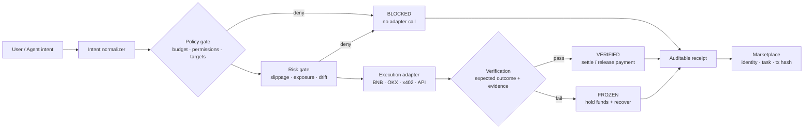

# Architecture

## One-page judge architecture

The judge can follow one action from proposal to receipt: policy failures stop
before execution, verification failures freeze settlement after execution, and
only verified outcomes release payment. The same control plane is reused by
each adapter; only the external execution transport changes.

The control plane is deliberately domain-neutral. Every high-risk agent action follows the same lifecycle:

1. **Intent** — normalize the model's proposal into an `AgentAction`.
2. **Policy** — check permissions, budgets, tools, targets, and approval thresholds.
3. **Risk** — evaluate the current account, portfolio, environment, and runtime drift.
4. **Execute** — call one adapter through the `ExecutionAdapter` contract.
5. **Verify** — compare the observed result with the expected result.
6. **Recover** — cancel, refund, freeze, reduce, or escalate when execution deviates.
7. **Receipt** — persist a tamper-evident decision and execution record.

The core must not import a vendor SDK directly. Vendor-specific code belongs in `adapters/`.

For exchange tracks, `adapters/okx` translates the neutral action into an OKX order,
returns the external `orderId`, and attaches an evidence hash. It does not duplicate
budget, permission, or risk logic.
